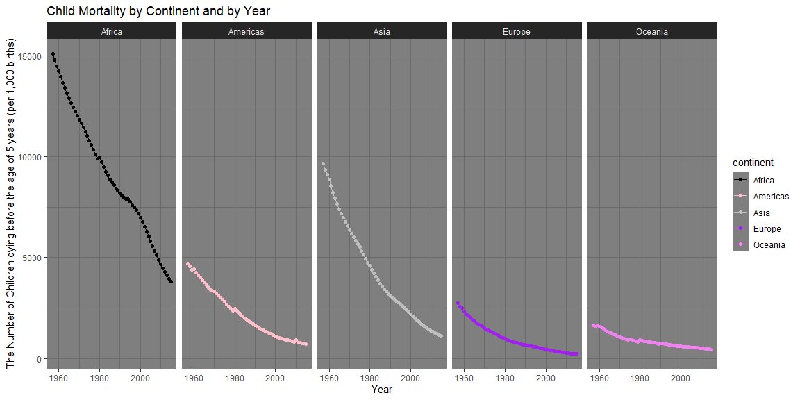

```r
child_mortality
```

```
## # A tibble: 44,926 x 10
##     year country continent population child_mort survival_per_wo~
##    <int> <chr>   <chr>          <int>      <dbl>            <dbl>
##  1  1957 Afghan~ Asia         9147286       378.             4.75
##  2  1958 Afghan~ Asia         9314915       372.             4.80
##  3  1959 Afghan~ Asia         9489453       366.             4.85
##  4  1960 Afghan~ Asia         9671046       361.             4.89
##  5  1961 Afghan~ Asia         9859928       355.             4.94
##  6  1962 Afghan~ Asia        10056480       350.             4.98
##  7  1963 Afghan~ Asia        10261254       344.             5.02
##  8  1964 Afghan~ Asia        10474903       339.             5.07
##  9  1965 Afghan~ Asia        10697983       334.             5.11
## 10  1966 Afghan~ Asia        10927724       329.             5.15
## # ... with 44,916 more rows, and 4 more variables: deaths_per_woman <dbl>,
## #   poverty <dbl>, education <dbl>, health_exp <dbl>
```


```r
d <- select(death, everything())
```


```r
rate <- child_mortality
rate %>% 
  filter(year >= 1957 & !is.na(continent)) %>%
  group_by(continent, year) %>% 
  summarise(child_mort = sum(child_mort, na.rm = TRUE)) %>% 
ggplot(aes(x = year, y = child_mort, color = continent)) +
    geom_point() +geom_line()+ facet_wrap(~continent,nrow=1)+
    theme_dark() + scale_color_manual(values = c("black","pink","gray","purple","violet"))+
    labs(
      title = "Child Mortality by Continent and by Year",
      x = "Year",
      y = "The Number of Children dying before the age of 5 years (per 1,000 births)"
    )
```

<!-- -->


I am trying to reproduce a graph from []https://ourworldindata.org/child-mortality
The graph shows how the number of deaths for children under 5 years has been changing between 1990 and 2017


```r
data <- read.csv("C:/Users/exoni/Downloads/child-deaths-igme-data.csv")
da <- filter(data,Year>=1990)
dat <- da %>% group_by(Year) %>% summarise(World=sum(deaths))
dat$World <- dat$World/1000000
P <- ggplot(dat)+geom_line(aes(Year,World),color="blue",size=1)+geom_point(aes(Year,World),color="blue",size=3)+labs(y= "Number of Deaths in the World(in millions)",title="Number of Child Death, 1990-2017. \n Number of Deaths of children under 5 years old.")+theme_bw()

ggplotly(P, tooltip=c("World","Year"),width = 1000, height = 600) %>%
    animation_opts(17)
```

<!--html_preserve--><div id="htmlwidget-5291d556ce87f2ee3a75" style="width:1000px;height:600px;" class="plotly html-widget"></div>
<script type="application/json" data-for="htmlwidget-5291d556ce87f2ee3a75">{"x":{"data":[{"x":[1990,1991,1992,1993,1994,1995,1996,1997,1998,1999,2000,2001,2002,2003,2004,2005,2006,2007,2008,2009,2010,2011,2012,2013,2014,2015,2016,2017],"y":[144.579179,142.077917,139.342589,136.511349,133.978804,130.779112,127.576569,124.672435,121.729974,118.411949,115.08265,111.663905,108.205541,104.762304,101.734388,98.056394,94.845084,91.681826,88.875829,85.50065,83.085935,79.656789,76.849979,74.206219,71.73867,69.346916,67.144356,65.044647],"text":["Year: 1990<br />World: 144.57918","Year: 1991<br />World: 142.07792","Year: 1992<br />World: 139.34259","Year: 1993<br />World: 136.51135","Year: 1994<br />World: 133.97880","Year: 1995<br />World: 130.77911","Year: 1996<br />World: 127.57657","Year: 1997<br />World: 124.67243","Year: 1998<br />World: 121.72997","Year: 1999<br />World: 118.41195","Year: 2000<br />World: 115.08265","Year: 2001<br />World: 111.66390","Year: 2002<br />World: 108.20554","Year: 2003<br />World: 104.76230","Year: 2004<br />World: 101.73439","Year: 2005<br />World:  98.05639","Year: 2006<br />World:  94.84508","Year: 2007<br />World:  91.68183","Year: 2008<br />World:  88.87583","Year: 2009<br />World:  85.50065","Year: 2010<br />World:  83.08594","Year: 2011<br />World:  79.65679","Year: 2012<br />World:  76.84998","Year: 2013<br />World:  74.20622","Year: 2014<br />World:  71.73867","Year: 2015<br />World:  69.34692","Year: 2016<br />World:  67.14436","Year: 2017<br />World:  65.04465"],"type":"scatter","mode":"lines+markers","line":{"width":3.77952755905512,"color":"rgba(0,0,255,1)","dash":"solid"},"hoveron":"points","showlegend":false,"xaxis":"x","yaxis":"y","hoverinfo":"text","marker":{"autocolorscale":false,"color":"rgba(0,0,255,1)","opacity":1,"size":11.3385826771654,"symbol":"circle","line":{"width":1.88976377952756,"color":"rgba(0,0,255,1)"}},"frame":null}],"layout":{"margin":{"t":45.7108066971081,"r":7.30593607305936,"b":42.130898021309,"l":43.1050228310502},"plot_bgcolor":"rgba(255,255,255,1)","paper_bgcolor":"rgba(255,255,255,1)","font":{"color":"rgba(0,0,0,1)","family":"","size":14.6118721461187},"title":{"text":"Number of Child Death, 1990-2017. <br /> Number of Deaths of children under 5 years old.","font":{"color":"rgba(0,0,0,1)","family":"","size":17.5342465753425},"x":0,"xref":"paper"},"xaxis":{"domain":[0,1],"automargin":true,"type":"linear","autorange":false,"range":[1988.65,2018.35],"tickmode":"array","ticktext":["1990","2000","2010"],"tickvals":[1990,2000,2010],"categoryorder":"array","categoryarray":["1990","2000","2010"],"nticks":null,"ticks":"outside","tickcolor":"rgba(51,51,51,1)","ticklen":3.65296803652968,"tickwidth":0.66417600664176,"showticklabels":true,"tickfont":{"color":"rgba(77,77,77,1)","family":"","size":11.689497716895},"tickangle":-0,"showline":false,"linecolor":null,"linewidth":0,"showgrid":true,"gridcolor":"rgba(235,235,235,1)","gridwidth":0.66417600664176,"zeroline":false,"anchor":"y","title":{"text":"Year","font":{"color":"rgba(0,0,0,1)","family":"","size":14.6118721461187}},"hoverformat":".2f"},"yaxis":{"domain":[0,1],"automargin":true,"type":"linear","autorange":false,"range":[61.0679204,148.5559056],"tickmode":"array","ticktext":["80","100","120","140"],"tickvals":[80,100,120,140],"categoryorder":"array","categoryarray":["80","100","120","140"],"nticks":null,"ticks":"outside","tickcolor":"rgba(51,51,51,1)","ticklen":3.65296803652968,"tickwidth":0.66417600664176,"showticklabels":true,"tickfont":{"color":"rgba(77,77,77,1)","family":"","size":11.689497716895},"tickangle":-0,"showline":false,"linecolor":null,"linewidth":0,"showgrid":true,"gridcolor":"rgba(235,235,235,1)","gridwidth":0.66417600664176,"zeroline":false,"anchor":"x","title":{"text":"Number of Deaths in the World(in millions)","font":{"color":"rgba(0,0,0,1)","family":"","size":14.6118721461187}},"hoverformat":".2f"},"shapes":[{"type":"rect","fillcolor":"transparent","line":{"color":"rgba(51,51,51,1)","width":0.66417600664176,"linetype":"solid"},"yref":"paper","xref":"paper","x0":0,"x1":1,"y0":0,"y1":1}],"showlegend":false,"legend":{"bgcolor":"rgba(255,255,255,1)","bordercolor":"transparent","borderwidth":1.88976377952756,"font":{"color":"rgba(0,0,0,1)","family":"","size":11.689497716895}},"hovermode":"closest","width":1000,"height":600,"barmode":"relative"},"config":{"doubleClick":"reset","showSendToCloud":false},"source":"A","attrs":{"61d06a07a42":{"x":{},"y":{},"type":"scatter"},"61d03d0e3ad1":{"x":{},"y":{}}},"cur_data":"61d06a07a42","visdat":{"61d06a07a42":["function (y) ","x"],"61d03d0e3ad1":["function (y) ","x"]},"highlight":{"on":"plotly_click","persistent":false,"dynamic":false,"selectize":false,"opacityDim":0.2,"selected":{"opacity":1},"debounce":0},"shinyEvents":["plotly_hover","plotly_click","plotly_selected","plotly_relayout","plotly_brushed","plotly_brushing","plotly_clickannotation","plotly_doubleclick","plotly_deselect","plotly_afterplot","plotly_sunburstclick"],"base_url":"https://plot.ly"},"evals":[],"jsHooks":[]}</script><!--/html_preserve-->


